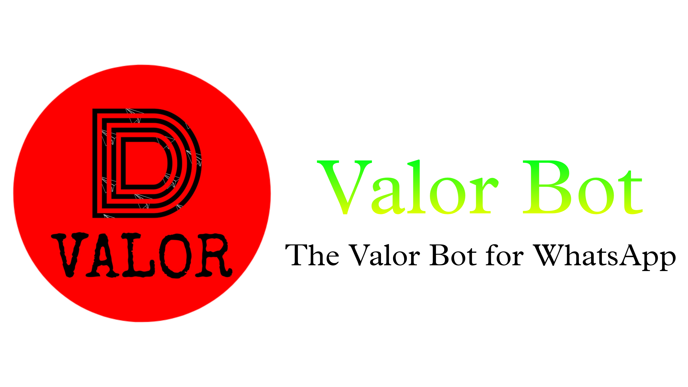
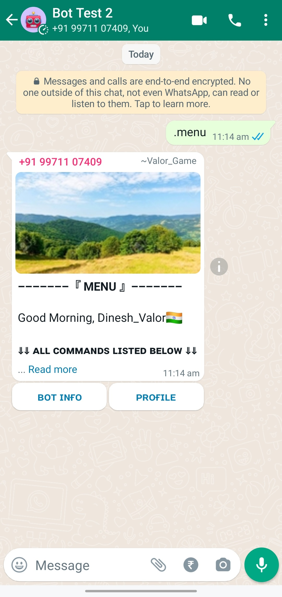
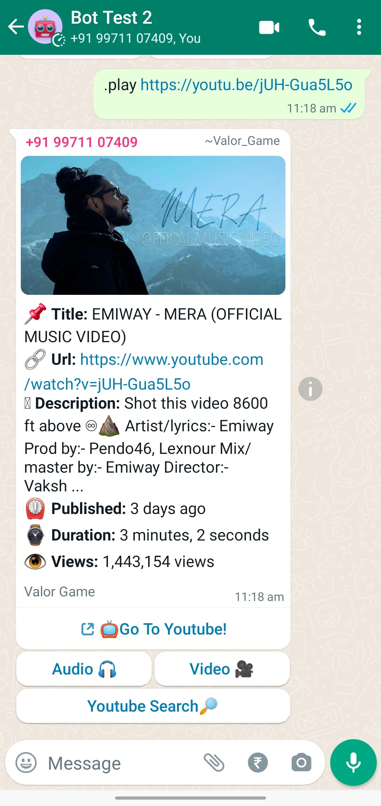
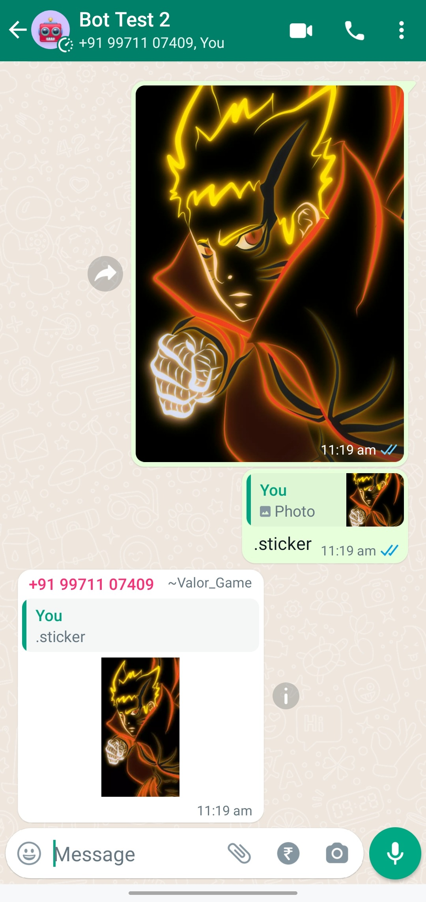
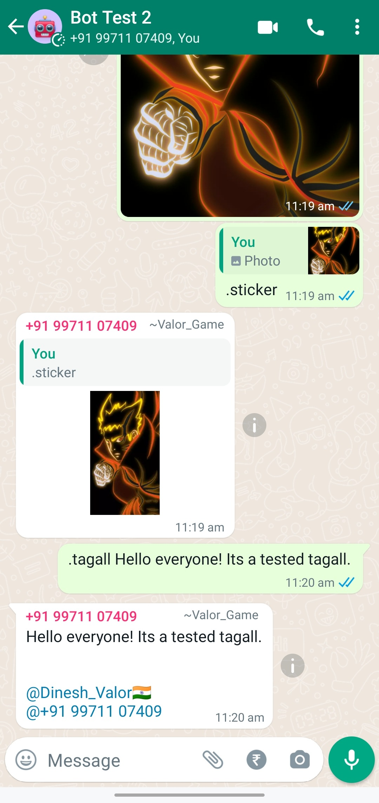

 
 

#### This is not an officially supported WhatsApp product

## Introduction
Valor Bot is a suite of open source software for WhatsApp Application based on Baileys WebSocket API.
> WhatsApp Supported Version: 2.22.8.7

_Some highlight features_:

- **Downloader**: Download Audio/Video from YouTube, TikTok, Instagram, Facebook, etc
- **Sticker Creator**: Create Sticker from Image/Video/Text
- **Tag All**: Tag Everyone at once, no more headache to tag each single
- **Game**: Games in whatsapp such as RPG Games, Leaderboard, Inventory, Math Quiz, etc
- **Internet Search**: Google Text/Image, Facebook, Pinterest, Wikipedia
- **AFK**: Away From Keyboard in group
- **Broadcast**: Broadcast message to all Groups & everyone

**Screenshots**

|  |  |  |  |
|--------------------------------------------------------------------------------------------------------------------|--------------------------------------------------------------------------------------------------------------------|--------------------------------------------------------------------------------------------------------------------|--------------------------------------------------------------------------------------------------------------------|
| Sample-1                                                                                                           | Sample-2                                                                                                           | Sample-3                                                                                                           | Sample-4                                                                                                           |

## Downloads

[Github](https://github.com/DineshValor/valor/) is the only source where you can get official Valor Bot information and downloads.

## Useful Links
- [Installation Instruction](https://dineshvalor.github.io/valor/install)
- [Frequently Asked Questions](https://dineshvalor.github.io/valor/faq)
- [Troubleshoot](https://dineshvalor.github.io/puppeteer/troubleshooting)

### Invite/Add Bot in your Group?
1. Join [Valor Bot Invite](https://chat.whatsapp.com/BqNITpkNqKuGkyMzGleZtI) group.

2. Type and send as shown below message in “Valor Bot Invite” group.  
#join <group_link>

- Example  
#join https://chat.whatsapp.com/BqNITpkNqKuGkyMzGleZtI
> (replace `‘https://chat.whatsapp.com/BqNITpkNqKuGkyMzGleZtI’` with your group link)

### Test & Report Bug/Error/Issue or Feature Request?

Test and Report Bug/Error/Issue or Feature Request on official Valor Bot repository under Issue section.

## License

    Valor-Bot, including all git submodules are free software:
    you can redistribute it and/or modify it under the terms of the
    GNU General Public License as published by the Free Software Foundation,
    either version 3 of the License, or (at your option) any later version.

    This program is distributed in the hope that it will be useful,
    but WITHOUT ANY WARRANTY; without even the implied warranty of
    MERCHANTABILITY or FITNESS FOR A PARTICULAR PURPOSE.  See the
    GNU General Public License for more details.

    You should have received a copy of the GNU General Public License
    along with this program.  If not, see <http://www.gnu.org/licenses/>.

## Thanks To

 |  |  |  
----|----|----|----
[DineshValor](https://github.com/DineshValor) | [Nurutomo](https://github.com/Nurutomo) | [BochilGaming](https://github.com/BochilGaming) | [X-Team](https://api.xteam.xyz/)
Valor-Bot Author | Script Writer | Script Editor | Powered by X-Team

## Support Project

 | 
----|----
[UPI PAY](https://raw.githubusercontent.com/DineshValor/valor/bot/docs/images/upi-qrcode.jpg) | [PayPal](https://www.paypal.me/DineshValor)
🇮🇳 Domestic Support | 🌐 Global Support
